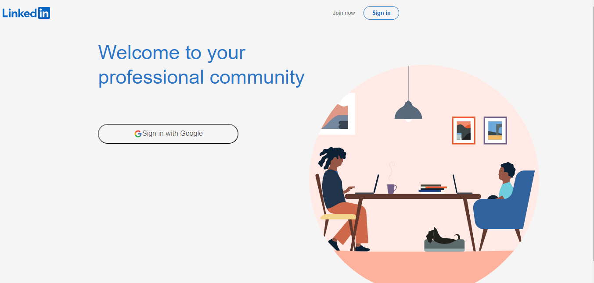

# Full-Stack Linkedin Clone Link Preview :

https://655e70221c57177c9b8ded45--musical-marzipan-d9d94e.netlify.app/

  

# Tools

- html  
- css  
- styled-components  
- javascript  
- react router dom  
- react hooks  
- react-player  
- redux  
- redux-thunk  
- firebase  

# Features

- LogIn page 
- firebase authentication with google account  
- firebase storage  
- Home page  
- user can login and add posts [image - video link - text]  
- user can logout  

This template provides a minimal setup to get React working in Vite with HMR and some ESLint rules.

Currently, two official plugins are available:

- [@vitejs/plugin-react](https://github.com/vitejs/vite-plugin-react/blob/main/packages/plugin-react/README.md) uses [Babel](https://babeljs.io/) for Fast Refresh
- [@vitejs/plugin-react-swc](https://github.com/vitejs/vite-plugin-react-swc) uses [SWC](https://swc.rs/) for Fast Refresh
